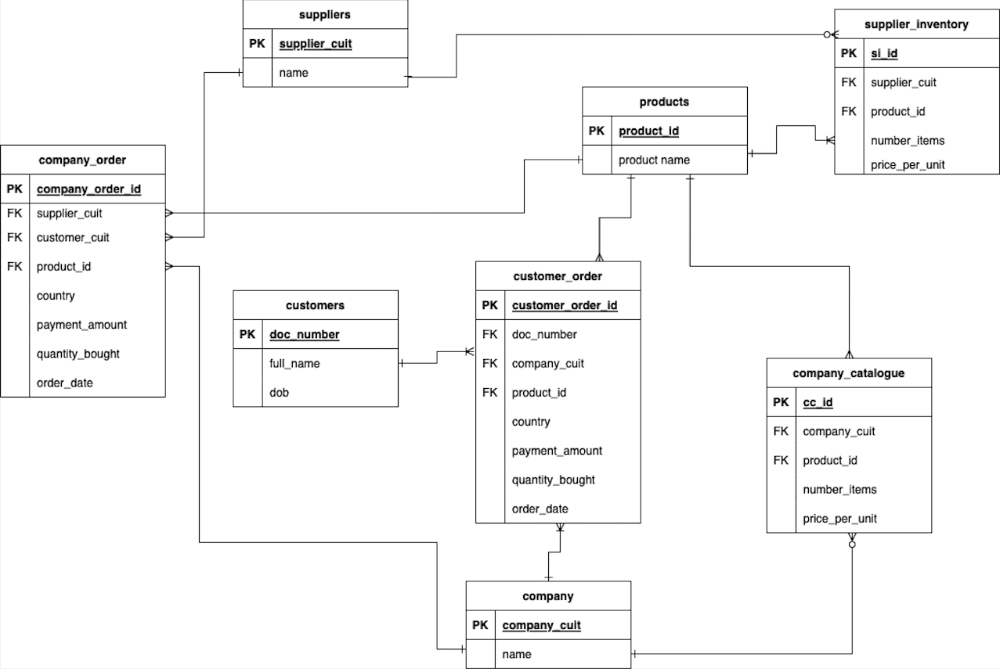
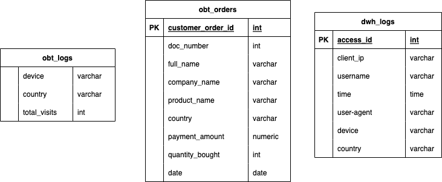

# B2B ETL Pipeline from Source DB and Web-logs
Stand-alone project that: 
  * Runs containers for the source transactional database, destination analytical database, Airflow scheduler and a lightweight DB client
  * Creates a source postegres database model for B2B
  * Creates a destination database, pipeline and model to meet B2B's analytics requirements
  * Moves data from a source postgres database to a destination postgres database 
  * Generates logs and moves them to a destination postgres database

## Setup 
* Clone the repository

Change directory within the repository and run `docker-compose up -d`. This will perform the following:
* Based on the definition of [`docker-compose.yml`](https://github.com/konosp/dbt-airflow-docker-compose/blob/master/docker-compose.yml) will download the necessary images to run the project. This includes the following services:
  * postgres-source: DB for transactions from which data will be extracted
  * postgres-destination: DB for analytics where data will be loaded
  * postgres-airflow: DB for Airflow to connect and store task execution information
  * airflow: Python-based image to execute Airflow scheduler and webserver
  * adminer: a lightweight DB client

## Connections
  * Adminer UI: http://localhost:8080
  * Airflow UI: http://localhost:8000

## How to ran the DAGs
Once everything is up and running, navigate to the Airflow UI (see connections above). You will be presented with the list of DAGs, all Off by default.
You will need to first run create_log_dag to generate logs. You can then run log_to_destination_dag and source_to_destination dag to start the ETL.

## Data Models
Source Data Model

Log and Orders One Big Tables and Logs Table

